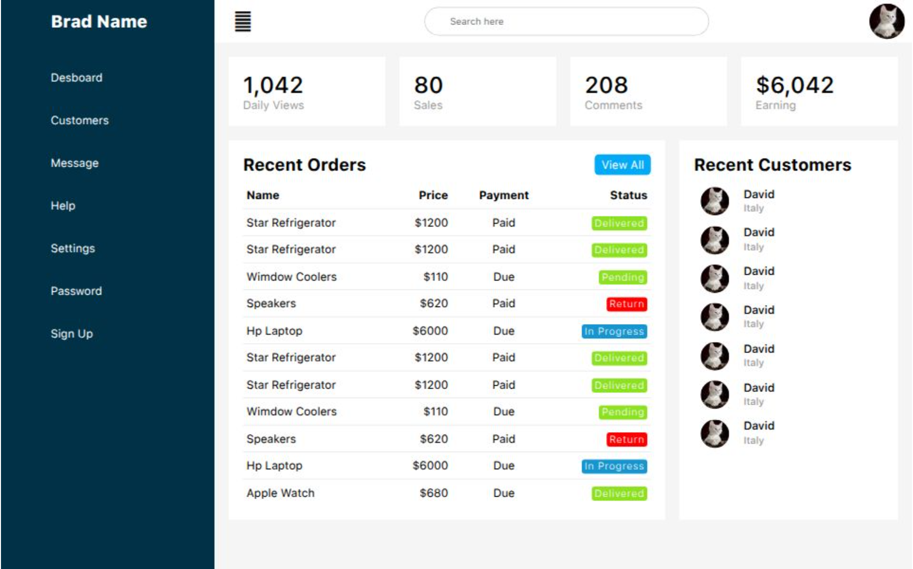

# 📈 Projeto de Dashboard

### Autor: Ender J. Guaina V.



Foi criado um dashboard para aprendizado de exercicios praticos utilizando habilidades de HTML, CSS e Javascript assim podendo obter o conhecimento de como realizar este tipo de funcionalidades para um sistema web

🔗 **[Acesse o site aqui](https://projet-desboard.vercel.app/)**

---

## ✨ Recursos
- 🌐 **Compatível com Todos os Navegadores Modernos**
- 💎 **Clone de Grande empresa do mercado de Streaming**

---

## 🛠️ Tecnologias Utilizadas

- HTML5
- CSS3 (Flexbox & Grid)
- JavaScript

---

## 🚀 Como Rodar Localmente

1. **Clone o repositório:**
   ```bash
   git clone https://github.com/EnderJGV/Projet-Desboard.git
